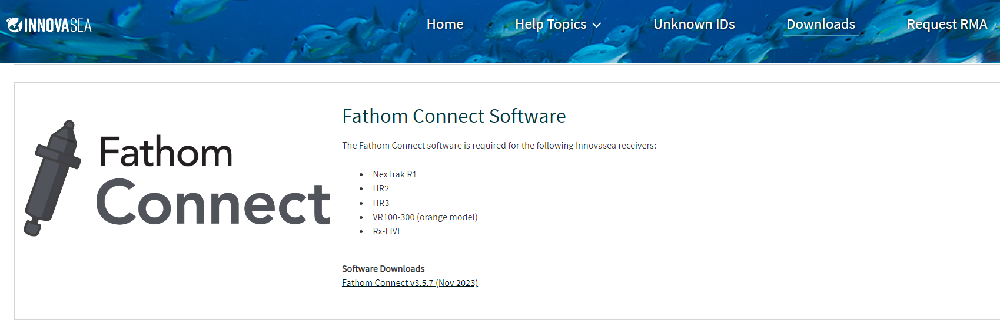

<!-- README.md is  generated from README.Rmd. Please edit that file -->

```{r, include = FALSE}
knitr::opts_chunk$set(
  collapse = TRUE,
  comment = "#>",
  fig.path = "man/figures/README-",
  out.width = "100%"
)
```

# rvdat

<!-- badges: start -->
[](https://lifecycle.r-lib.org/articles/stages.html#experimental)
[](https://github.com/mhpob/rvdat/actions/workflows/R-CMD-check.yaml)
[](https://app.codecov.io/gh/mhpob/rvdat?branch=main)
<!-- badges: end -->

The intent of this package is to provide lightweight R wrapper functions around Innovasea's VDAT File Tool for those who are intimidated by the shell (me) or just want to keep everything in one language (R, also me).

`rvdat` is intended to play nicely with the [`matos`](https://matos.obrien.page) and [`otndo`](https://otndo.obrien.page) packages, though full connectivity and documentation on how to do so is a work in progress. Please reach out to me at [mike@obrien.page](mailto:mike@obrien.page) or open an issue on GitHub if you need any help.

For similar implementation that has a few more bells and whistles, check out [`glatos::vdat_convert`](https://github.com/ocean-tracking-network/glatos/blob/dev/R/util-vdat.r) in version >= 0.8.0 of the [glatos package](https://github.com/ocean-tracking-network/glatos).


## Installation

### Download `vdat.exe`

`rvdat` requires a VDAT executable (`vdat.exe`) in order to work, which comes packaged in Innovasea's Fathom Connect software. You can [download the software here](https://support.fishtracking.innovasea.com/s/downloads) after providing your contact details and agreeing to their End User License Agreement.



### Install Fathom Connect
#### On Windows

Fathom Connect is a Windows-specific program, so if you're running Windows, you're in luck! Just extract and run the installer, paying attention into which directory the program is installed. The default install location on Windows machines is `C:\Program Files\Innovasea\Fathom Connect`.

#### On Linux

Innovasea does not provide a non-Windows version of Fathom Connect and `vdat.exe`. If you're up for doing a little bit more work, you can run `vdat.exe`, and thus `rdvat`, using [Wine](https://www.winehq.org). [Install Wine](https://gitlab.winehq.org/wine/wine/-/wikis/Download) on your Linux distribution of choice, followed by [Winetricks](https://github.com/Winetricks/winetricks); the latter is used to install the needed Windows .NET frameworks: v4.5.2 is needed to run the installer and v 4.8 is needed to run the program. Note that this is a ~1.75GB installation.

After installing, initiate Wine via `wineboot`, then use `winetricks` to set Wine to run as Windows 10 (or greater) and install the needed .NET frameworks.

```{bash, eval=FALSE, engine='sh'}
wineboot
winetricks -q win10 dotnet452 dotnet48
```

Now, you need to install Fathom Connect. The installer is usually named something like "Install-Fathom-Connect-SOMELONGVERSION.msi", switch this with "Fathom-Connect-Installer.msi" below.

```{bash, eval=FALSE, engine='sh'}
wine msiexec /i Fathom-Connect-Installer.msi /qb
```
If things don't work and you're not working headless, run `wine uninstaller` and install via the GUI interface. Yes, it is "`uninstaller`" (counter-intuitive).

### On Mac

Similar to Linux, [install Wine](https://gitlab.winehq.org/wine/wine/-/wikis/MacOS). Install Fathom Connect accordingly.

### Install `rvdat`

You can install the most-up-to-date version of this package from [R-universe](https://mhpob.r-universe.dev/rvdat) or [GitHub](https://github.com/mhpob/rvdat).

R-universe:
```{r eval=FALSE}
install.packages(
  "rvdat",
  repos = c(
    "https://mhpob.r-universe.dev",
    "https://cloud.r-project.org"
  )
)
```

GitHub:
```{r eval=FALSE}
# install.packages("remotes")
remotes::install_github("mhpob/rvdat")
```

## Progress
### To do

-   [ ] Sensor values
-   [ ] Logging

### Completed

-   [X] Check VDAT is where you say it is
-   Convert VDAT file to
    -   [X] CSV
    -   [X] folder of CSVs by factor
    -   [X] JSON
-   [X] Output location
-   [X] Time correction
-   [X] Inspect content of file
-   [X] Create CSV template
-   [X] Look for `vdat.exe`

### Won't add (for now)

-   [ ] ~~Detection filter~~
    -   only implemented for HR3 VDAT files; will implement when there's a file to test
-   [ ] ~~Convert multiple VRLs~~
    -   Removed from `vdat.exe` in spring 2023. Left to user.
-   [ ] ~~Time offset~~
    -   Won't add; subtracts a number of hours from the time without being DST-aware.
-   [ ] ~~JSON template~~
    -   The `json.rxlog` and `vfwp` formats noted in the help documentation were for internal testing and not intended to be exposed. (See [this issue](https://github.com/mhpob/rvdat/issues/15#issuecomment-2214421397))


## Using the package

Load the package:
```{r}
library(rvdat)
```

Set or look for system location of vdat.exe:
```{r}
vdat_here()
```

What version?
```{r}
vdat_version()
```

Convert a VRL to CSV:
```{r, label=downdload-files, echo=FALSE}
td <- file.path(tempdir(), "readme_files")
dir.create(td)

download.file(
  URLencode(
    file.path(
      "https://github.com/ocean-tracking-network/glatos/raw/dev/inst/extdata",
      "detection_files_raw/HR2-180_461396_2021-04-20_173145.vdat"
    )
  ),
  destfile = file.path(
    td,
    "HR2-180_461396_2021-04-20_173145.vdat"
  ),
  mode = "wb", quiet = TRUE
)
```

```{r, eval=-1, echo=1}
vdat_to_csv("SOME-VDAT-FILE")

vdat_to_csv(list.files(td, pattern = "HR2.*\\.vdat$", full.names = T),
  outdir = td
)
```

Convert a VRL to a folder of CSVs split by data type:
```{r, eval=c(-1, -5), echo=c(1, 5)}
vdat_to_folder("SOME-VDAT-FILE")

vdat_to_folder(list.files(td, pattern = "HR2.*\\.vdat$", full.names = T),
  outdir = td
)

list.files("SOME-VDAT-FILE.csv-fathom-split")

list.files(
  file.path(td, "HR2-180_461396_2021-04-20_173145.vdat.csv-fathom-split")
)
```

Check out the file metadata:

```{r, eval=-1, echo=1}
vdat_inspect("SOME-VDAT-FILE")

vdat_inspect(list.files(td, pattern = "HR2.*\\.vdat$", full.names = T))
```

See the fields associated with different data types:

```{r}
vdat_template(format = "csv.fathom")
```


Call VDAT using standard flags:
```{r}
vdat_call("--help")
```


## Development notes
If contributing, please use the following general style:

-   All functions that call vdat.exe should use [`vdat_call`](https://rvdat.obrien.page/reference/vdat_call.html).
-   Create informative messages, warnings, and errors using the [`cli` package](https://cli.r-lib.org/).
-   In summary:

```{r, eval=FALSE}
a_new_wrapper <- function(some_command) {
  vdat_call("--do this")

  cli::cli_alert_success("Woohoo!!")
}
```


```{r, label=clean-up-files, echo=FALSE}
unlink(td, recursive = TRUE)
```

