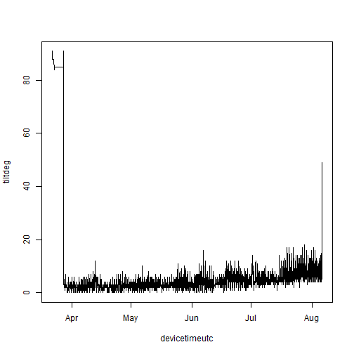
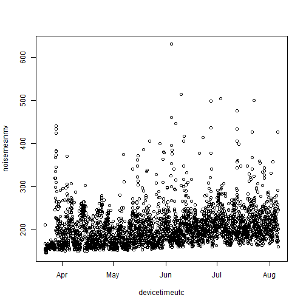
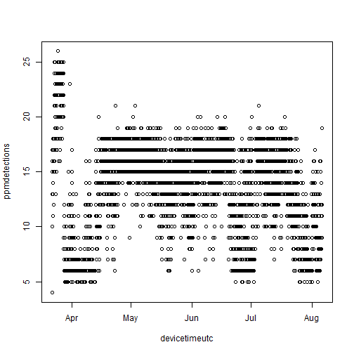
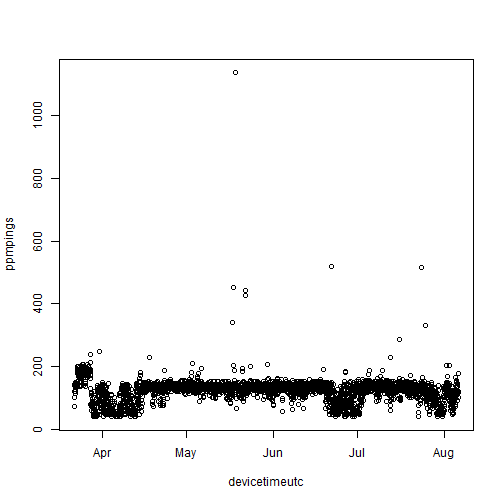

We often want to extract the environmental data that some of our receivers log. You can do this by going into Innovasea's VUE or Fathom Connect programs and clicking a bunch of buttons, or you can do it programmatically and reproducibly by combining `matos` and [`rvdat`](https://rvdat.obrien.page).


``` r
library(matos)
library(rvdat)
```

## Download the data

If you're an ACT member, log into your MATOS account. If you're not, we'll skip to the next section and assume you already have your files ready.


``` r
matos_login()
#> ! Please log in.
#> v Login successful!
```

Next, tell `rvdat` the location of the `vdat.exe` executable (check out the [`rvdat` documentation](https://rvdat.obrien.page) for more information on this).


``` r
vdat_here()
```

Using `matos`, I'm going to find the VDAT files associated with the [Mid-Bay Chesapeake Backbone array](https://matos.asascience.com/project/detail/161). Note that things like temperature and tilt are logged within the VRL/VDAT files, and so will be under the "detections" file type.


``` r
detection_files <- list_project_files(
  project = "UMCES Chesapeake Backbone, Mid-Bay",
  file_type = "detections"
)

head(detection_files)
#>   project                  file_type upload_date
#> 3     161 Tag Detections - .vfl file  2024-08-06
#> 4     161 Tag Detections - .vfl file  2024-08-06
#> 5     161 Tag Detections - .vfl file  2024-08-06
#> 6     161 Tag Detections - .vfl file  2024-08-06
#> 7     161 Tag Detections - .vfl file  2024-08-06
#> 8     161 Tag Detections - .vfl file  2024-08-06
#>                     file_name
#> 3 VR2AR_551436_20240805_1.vrl
#> 4 VR2AR_551431_20240805_1.vrl
#> 5 VR2AR_550744_20240805_1.vrl
#> 6 VR2AR_550740_20240805_1.vrl
#> 7 VR2AR_550737_20240805_1.vrl
#> 8 VR2AR_545764_20240805_1.vrl
#>                                                       url
#> 3 https://matos.asascience.com/projectfile/download/13872
#> 4 https://matos.asascience.com/projectfile/download/13871
#> 5 https://matos.asascience.com/projectfile/download/13870
#> 6 https://matos.asascience.com/projectfile/download/13869
#> 7 https://matos.asascience.com/projectfile/download/13868
#> 8 https://matos.asascience.com/projectfile/download/13867
```

I'll download the first file into a temporary directory.


``` r
get_project_file(
  url = detection_files$url[1],
  out_dir = tempdir()
)
#> 
#> -- Downloading files ---------------------------------------------------
#> v File(s) saved to:
#>    C:\Users\darpa2\AppData\Local\Temp\RtmpusjJ5z\VR2AR_551436_20240805_1.vrl
#> [1] "C:\\Users\\darpa2\\AppData\\Local\\Temp\\RtmpusjJ5z\\VR2AR_551436_20240805_1.vrl"

vrl_file <- list.files(tempdir(), pattern = "vrl$", full.names = T)
```

## Convert VRL using `rvdat`

Now, I'll use `rvdat::vdat_to_folder` to convert that file into a folder of CSV files, each one representing one data type.


``` r
vdat_to_folder(
  vrl_file,
  outdir = tempdir()
)
#> 0.0% - Converting File
0.9% - Converting File
1.1% - Converting File
1.3% - Converting File
1.4% - Converting File
1.6% - Converting File
1.8% - Converting File
1.9% - Converting File
2.1% - Converting File
2.3% - Converting File
2.4% - Converting File
2.6% - Converting File
2.8% - Converting File
2.9% - Converting File
3.1% - Converting File
3.3% - Converting File
3.4% - Converting File
3.6% - Converting File
3.8% - Converting File
3.9% - Converting File
4.1% - Converting File
4.3% - Converting File
4.5% - Converting File
4.6% - Converting File
4.8% - Converting File
5.0% - Converting File
5.1% - Converting File
5.3% - Converting File
5.5% - Converting File
5.6% - Converting File
5.8% - Converting File
6.0% - Converting File
6.1% - Converting File
6.3% - Converting File
6.5% - Converting File
6.6% - Converting File
6.8% - Converting File
7.0% - Converting File
7.1% - Converting File
7.3% - Converting File
7.5% - Converting File
7.6% - Converting File
7.8% - Converting File
8.0% - Converting File
8.2% - Converting File
8.3% - Converting File
8.5% - Converting File
8.7% - Converting File
8.8% - Converting File
9.0% - Converting File
9.2% - Converting File
9.3% - Converting File
9.5% - Converting File
9.7% - Converting File
9.8% - Converting File
10.0% - Converting File
10.2% - Converting File
10.3% - Converting File
10.5% - Converting File
10.7% - Converting File
10.8% - Converting File
11.0% - Converting File
11.2% - Converting File
11.3% - Converting File
11.5% - Converting File
11.7% - Converting File
11.8% - Converting File
12.0% - Converting File
12.2% - Converting File
12.4% - Converting File
12.5% - Converting File
12.7% - Converting File
12.9% - Converting File
13.0% - Converting File
13.2% - Converting File
13.4% - Converting File
13.5% - Converting File
13.7% - Converting File
13.9% - Converting File
14.0% - Converting File
14.2% - Converting File
14.4% - Converting File
14.5% - Converting File
14.7% - Converting File
14.9% - Converting File
15.0% - Converting File
15.2% - Converting File
15.4% - Converting File
15.5% - Converting File
15.7% - Converting File
15.9% - Converting File
16.1% - Converting File
16.2% - Converting File
16.4% - Converting File
16.6% - Converting File
16.7% - Converting File
16.9% - Converting File
17.1% - Converting File
17.2% - Converting File
17.4% - Converting File
17.6% - Converting File
17.7% - Converting File
17.9% - Converting File
18.1% - Converting File
18.2% - Converting File
18.4% - Converting File
18.6% - Converting File
18.7% - Converting File
18.9% - Converting File
19.1% - Converting File
19.2% - Converting File
19.4% - Converting File
19.6% - Converting File
19.7% - Converting File
19.9% - Converting File
20.1% - Converting File
20.3% - Converting File
20.4% - Converting File
20.6% - Converting File
20.8% - Converting File
20.9% - Converting File
21.1% - Converting File
21.3% - Converting File
21.4% - Converting File
21.6% - Converting File
21.8% - Converting File
21.9% - Converting File
22.1% - Converting File
22.3% - Converting File
22.4% - Converting File
22.6% - Converting File
22.8% - Converting File
22.9% - Converting File
23.1% - Converting File
23.3% - Converting File
23.4% - Converting File
23.6% - Converting File
23.8% - Converting File
23.9% - Converting File
24.1% - Converting File
24.3% - Converting File
24.5% - Converting File
24.6% - Converting File
24.8% - Converting File
25.0% - Converting File
25.1% - Converting File
25.3% - Converting File
25.5% - Converting File
25.6% - Converting File
25.8% - Converting File
26.0% - Converting File
26.1% - Converting File
26.3% - Converting File
26.5% - Converting File
26.6% - Converting File
26.8% - Converting File
27.0% - Converting File
27.1% - Converting File
27.3% - Converting File
27.5% - Converting File
27.6% - Converting File
27.8% - Converting File
28.0% - Converting File
28.2% - Converting File
28.3% - Converting File
28.5% - Converting File
28.7% - Converting File
28.8% - Converting File
29.0% - Converting File
29.2% - Converting File
29.3% - Converting File
29.5% - Converting File
29.7% - Converting File
29.8% - Converting File
30.0% - Converting File
30.2% - Converting File
30.3% - Converting File
30.5% - Converting File
30.7% - Converting File
30.8% - Converting File
31.0% - Converting File
31.2% - Converting File
31.3% - Converting File
31.5% - Converting File
31.7% - Converting File
31.8% - Converting File
32.0% - Converting File
32.2% - Converting File
32.4% - Converting File
32.5% - Converting File
32.7% - Converting File
32.9% - Converting File
33.0% - Converting File
33.2% - Converting File
33.4% - Converting File
33.5% - Converting File
33.7% - Converting File
33.9% - Converting File
34.0% - Converting File
34.2% - Converting File
34.4% - Converting File
34.5% - Converting File
34.7% - Converting File
34.9% - Converting File
35.0% - Converting File
35.2% - Converting File
35.4% - Converting File
35.5% - Converting File
35.7% - Converting File
35.9% - Converting File
36.1% - Converting File
36.2% - Converting File
36.4% - Converting File
36.6% - Converting File
36.7% - Converting File
36.9% - Converting File
37.1% - Converting File
37.2% - Converting File
37.4% - Converting File
37.6% - Converting File
37.7% - Converting File
37.9% - Converting File
38.1% - Converting File
38.2% - Converting File
38.4% - Converting File
38.6% - Converting File
38.7% - Converting File
38.9% - Converting File
39.1% - Converting File
39.2% - Converting File
39.4% - Converting File
39.6% - Converting File
39.7% - Converting File
39.9% - Converting File
40.1% - Converting File
40.3% - Converting File
40.4% - Converting File
40.6% - Converting File
40.8% - Converting File
40.9% - Converting File
41.1% - Converting File
41.3% - Converting File
41.4% - Converting File
41.6% - Converting File
41.8% - Converting File
41.9% - Converting File
42.1% - Converting File
42.3% - Converting File
42.4% - Converting File
42.6% - Converting File
42.8% - Converting File
42.9% - Converting File
43.1% - Converting File
43.3% - Converting File
43.4% - Converting File
43.6% - Converting File
43.8% - Converting File
43.9% - Converting File
44.1% - Converting File
44.3% - Converting File
44.5% - Converting File
44.6% - Converting File
44.8% - Converting File
45.0% - Converting File
45.1% - Converting File
45.3% - Converting File
45.5% - Converting File
45.6% - Converting File
45.8% - Converting File
46.0% - Converting File
46.1% - Converting File
46.3% - Converting File
46.5% - Converting File
46.6% - Converting File
46.8% - Converting File
47.0% - Converting File
47.1% - Converting File
47.3% - Converting File
47.5% - Converting File
47.6% - Converting File
47.8% - Converting File
48.0% - Converting File
48.2% - Converting File
48.3% - Converting File
48.5% - Converting File
48.7% - Converting File
48.8% - Converting File
49.0% - Converting File
49.2% - Converting File
49.3% - Converting File
49.5% - Converting File
49.7% - Converting File
49.8% - Converting File
50.0% - Converting File
50.2% - Converting File
50.3% - Converting File
50.5% - Converting File
50.7% - Converting File
50.8% - Converting File
51.0% - Converting File
51.2% - Converting File
51.3% - Converting File
51.5% - Converting File
51.7% - Converting File
51.8% - Converting File
52.0% - Converting File
52.2% - Converting File
52.4% - Converting File
52.5% - Converting File
52.7% - Converting File
52.9% - Converting File
53.0% - Converting File
53.2% - Converting File
53.4% - Converting File
53.5% - Converting File
53.7% - Converting File
53.9% - Converting File
54.0% - Converting File
54.2% - Converting File
54.4% - Converting File
54.5% - Converting File
54.7% - Converting File
54.9% - Converting File
55.0% - Converting File
55.2% - Converting File
55.4% - Converting File
55.5% - Converting File
55.7% - Converting File
55.9% - Converting File
56.1% - Converting File
56.2% - Converting File
56.4% - Converting File
56.6% - Converting File
56.7% - Converting File
56.9% - Converting File
57.1% - Converting File
57.2% - Converting File
57.4% - Converting File
57.6% - Converting File
57.7% - Converting File
57.9% - Converting File
58.1% - Converting File
58.2% - Converting File
58.4% - Converting File
58.6% - Converting File
58.7% - Converting File
58.9% - Converting File
59.1% - Converting File
59.2% - Converting File
59.4% - Converting File
59.6% - Converting File
59.7% - Converting File
59.9% - Converting File
60.1% - Converting File
60.3% - Converting File
60.4% - Converting File
60.6% - Converting File
60.8% - Converting File
60.9% - Converting File
61.1% - Converting File
61.3% - Converting File
61.4% - Converting File
61.6% - Converting File
61.8% - Converting File
61.9% - Converting File
62.1% - Converting File
62.3% - Converting File
62.4% - Converting File
62.6% - Converting File
62.8% - Converting File
62.9% - Converting File
63.1% - Converting File
63.3% - Converting File
63.4% - Converting File
63.6% - Converting File
63.8% - Converting File
63.9% - Converting File
64.1% - Converting File
64.3% - Converting File
64.5% - Converting File
64.6% - Converting File
64.8% - Converting File
65.0% - Converting File
65.1% - Converting File
65.3% - Converting File
65.5% - Converting File
65.6% - Converting File
65.8% - Converting File
66.0% - Converting File
66.1% - Converting File
66.3% - Converting File
66.5% - Converting File
66.6% - Converting File
66.8% - Converting File
67.0% - Converting File
67.1% - Converting File
67.3% - Converting File
67.5% - Converting File
67.6% - Converting File
67.8% - Converting File
68.0% - Converting File
68.2% - Converting File
68.3% - Converting File
68.5% - Converting File
68.7% - Converting File
68.8% - Converting File
69.0% - Converting File
69.2% - Converting File
69.3% - Converting File
69.5% - Converting File
69.7% - Converting File
69.8% - Converting File
70.0% - Converting File
70.2% - Converting File
70.3% - Converting File
70.5% - Converting File
70.7% - Converting File
70.8% - Converting File
71.0% - Converting File
71.2% - Converting File
71.3% - Converting File
71.5% - Converting File
71.7% - Converting File
71.8% - Converting File
72.0% - Converting File
72.2% - Converting File
72.4% - Converting File
72.5% - Converting File
72.7% - Converting File
72.9% - Converting File
73.0% - Converting File
73.2% - Converting File
73.4% - Converting File
73.5% - Converting File
73.7% - Converting File
73.9% - Converting File
74.0% - Converting File
74.2% - Converting File
74.4% - Converting File
74.5% - Converting File
74.7% - Converting File
74.9% - Converting File
75.0% - Converting File
75.2% - Converting File
75.4% - Converting File
75.5% - Converting File
75.7% - Converting File
75.9% - Converting File
76.1% - Converting File
76.2% - Converting File
76.4% - Converting File
76.6% - Converting File
76.7% - Converting File
76.9% - Converting File
77.1% - Converting File
77.2% - Converting File
77.4% - Converting File
77.6% - Converting File
77.7% - Converting File
77.9% - Converting File
78.1% - Converting File
78.2% - Converting File
78.4% - Converting File
78.6% - Converting File
78.7% - Converting File
78.9% - Converting File
79.1% - Converting File
79.2% - Converting File
79.4% - Converting File
79.6% - Converting File
79.7% - Converting File
79.9% - Converting File
80.1% - Converting File
80.3% - Converting File
80.4% - Converting File
80.6% - Converting File
80.8% - Converting File
80.9% - Converting File
81.1% - Converting File
81.3% - Converting File
81.4% - Converting File
81.6% - Converting File
81.8% - Converting File
81.9% - Converting File
82.1% - Converting File
82.3% - Converting File
82.4% - Converting File
82.6% - Converting File
82.8% - Converting File
82.9% - Converting File
83.1% - Converting File
83.3% - Converting File
83.4% - Converting File
83.6% - Converting File
83.8% - Converting File
83.9% - Converting File
84.1% - Converting File
84.3% - Converting File
84.5% - Converting File
84.6% - Converting File
84.8% - Converting File
85.0% - Converting File
85.1% - Converting File
85.3% - Converting File
85.5% - Converting File
85.6% - Converting File
85.8% - Converting File
86.0% - Converting File
86.1% - Converting File
86.3% - Converting File
86.5% - Converting File
86.6% - Converting File
86.8% - Converting File
87.0% - Converting File
87.1% - Converting File
87.3% - Converting File
87.5% - Converting File
87.6% - Converting File
87.8% - Converting File
88.0% - Converting File
88.2% - Converting File
88.3% - Converting File
88.5% - Converting File
88.7% - Converting File
88.8% - Converting File
89.0% - Converting File
89.2% - Converting File
89.3% - Converting File
89.5% - Converting File
89.7% - Converting File
89.8% - Converting File
90.0% - Converting File
90.2% - Converting File
90.3% - Converting File
90.5% - Converting File
90.7% - Converting File
90.8% - Converting File
91.0% - Converting File
91.2% - Converting File
91.3% - Converting File
91.5% - Converting File
91.7% - Converting File
91.8% - Converting File
92.0% - Converting File
92.2% - Converting File
92.4% - Converting File
92.5% - Converting File
92.7% - Converting File
92.9% - Converting File
93.0% - Converting File
93.2% - Converting File
93.4% - Converting File
93.5% - Converting File
93.7% - Converting File
93.9% - Converting File
94.0% - Converting File
94.2% - Converting File
94.4% - Converting File
94.5% - Converting File
94.7% - Converting File
94.9% - Converting File
95.0% - Converting File
95.2% - Converting File
95.4% - Converting File
95.5% - Converting File
95.7% - Converting File
95.9% - Converting File
96.1% - Converting File
96.2% - Converting File
96.4% - Converting File
96.6% - Converting File
96.7% - Converting File
96.9% - Converting File
97.1% - Converting File
97.2% - Converting File
97.4% - Converting File
97.6% - Converting File
97.7% - Converting File
97.9% - Converting File
98.1% - Converting File
98.2% - Converting File
98.4% - Converting File
98.6% - Converting File
98.7% - Converting File
98.9% - Converting File
99.1% - Converting File
99.2% - Converting File
99.4% - Converting File
99.6% - Converting File
99.7% - Converting File
100.0% - Converting File
                        
#> v File converted:
#>   C:\Users\darpa2\AppData\Local\Temp\RtmpusjJ5z/VR2AR_551436_20240805_1.vrl
#> i Files saved in:
#>   C:\Users\darpa2\AppData\Local\Temp\RtmpusjJ5z/VR2AR_551436_20240805_1.csv-fathom-split
```

There are quite a few files in there, but for this we're going to focus on the temperature records stored in `TEMP.csv`.


``` r
list.files(tempdir(), pattern = "fathom-split", full.names = T) |>
  list.files()
#>  [1] "ATTITUDE.csv"         "BATTERY.csv"         
#>  [3] "CFG_CHANNEL.csv"      "CFG_STUDY.csv"       
#>  [5] "CFG_TRANSMITTER.csv"  "CLOCK_REF.csv"       
#>  [7] "DATA_SOURCE_FILE.csv" "DEPTH.csv"           
#>  [9] "DET.csv"              "DIAG.csv"            
#> [11] "EVENT.csv"            "EVENT_INIT.csv"      
#> [13] "EVENT_OFFLOAD.csv"    "HEALTH_VR2AR.csv"    
#> [15] "TEMP.csv"

bwt_file <- list.files(tempdir(), pattern = "TEMP", full.names = T, recursive = T)
```

## Read it into R

Let's read in the data.


``` r
read.csv(bwt_file)
#> Error in read.table(file = file, header = header, sep = sep, quote = quote, : more columns than column names
```

An error, oh no! Let's see what's causing it.


``` r
read.csv(bwt_file,
  header = FALSE,
  nrows = 5
)
#>                  V1                  V2
#> 1 \357\273\277VEMCO DATA LOG               2.0.0
#> 2         TEMP_DESC   Device Time (UTC)
#> 3              TEMP 2024-03-21 20:00:00
#> 4              TEMP 2024-03-21 21:00:00
#> 5              TEMP 2024-03-21 22:00:00
#>                                    V3              V4
#> 1 vdat-11.0.1-20240830-d01c0d-release                
#> 2                                Time Time Offset (h)
#> 3                                                    
#> 4                                                    
#> 5                                                    
#>                    V5       V6            V7              V8
#> 1                                                           
#> 2 Time Correction (s)    Model Serial Number Ambient (deg C)
#> 3                     VR2AR-69        551436          20.722
#> 4                     VR2AR-69        551436          13.957
#> 5                     VR2AR-69        551436          10.479
#>                 V9
#> 1                 
#> 2 Internal (deg C)
#> 3                 
#> 4                 
#> 5
```

Ah, the data doesn't really start until the second row. Skip the first one and take a look.


``` r
bwt <- read.csv(
  bwt_file,
  skip = 1
)

head(bwt)
#>   TEMP_DESC   Device.Time..UTC. Time Time.Offset..h.
#> 1      TEMP 2024-03-21 20:00:00   NA              NA
#> 2      TEMP 2024-03-21 21:00:00   NA              NA
#> 3      TEMP 2024-03-21 22:00:00   NA              NA
#> 4      TEMP 2024-03-21 23:00:00   NA              NA
#> 5      TEMP 2024-03-22 00:00:00   NA              NA
#> 6      TEMP 2024-03-22 01:00:00   NA              NA
#>   Time.Correction..s.    Model Serial.Number Ambient..deg.C.
#> 1                  NA VR2AR-69        551436          20.722
#> 2                  NA VR2AR-69        551436          13.957
#> 3                  NA VR2AR-69        551436          10.479
#> 4                  NA VR2AR-69        551436           8.328
#> 5                  NA VR2AR-69        551436           6.157
#> 6                  NA VR2AR-69        551436           5.136
#>   Internal..deg.C.
#> 1               NA
#> 2               NA
#> 3               NA
#> 4               NA
#> 5               NA
#> 6               NA
```

Great! The data are in. I'm going to clean up the names a little bit and convert the time column from a character string to POSIX time.


``` r
names(bwt) <- gsub("[_\\.]", "", tolower(names(bwt)))

names(bwt)
#> [1] "tempdesc"        "devicetimeutc"   "time"           
#> [4] "timeoffseth"     "timecorrections" "model"          
#> [7] "serialnumber"    "ambientdegc"     "internaldegc"

bwt$devicetimeutc <- as.POSIXct(bwt$devicetimeutc,
  tz = "UTC",
  format = "%F %T"
)

head(bwt)
#>   tempdesc       devicetimeutc time timeoffseth timecorrections
#> 1     TEMP 2024-03-21 20:00:00   NA          NA              NA
#> 2     TEMP 2024-03-21 21:00:00   NA          NA              NA
#> 3     TEMP 2024-03-21 22:00:00   NA          NA              NA
#> 4     TEMP 2024-03-21 23:00:00   NA          NA              NA
#> 5     TEMP 2024-03-22 00:00:00   NA          NA              NA
#> 6     TEMP 2024-03-22 01:00:00   NA          NA              NA
#>      model serialnumber ambientdegc internaldegc
#> 1 VR2AR-69       551436      20.722           NA
#> 2 VR2AR-69       551436      13.957           NA
#> 3 VR2AR-69       551436      10.479           NA
#> 4 VR2AR-69       551436       8.328           NA
#> 5 VR2AR-69       551436       6.157           NA
#> 6 VR2AR-69       551436       5.136           NA
```

## See what we've got

Now that we have our time series, let's see what it looks like!


``` r
plot(ambientdegc ~ devicetimeutc,
  data = bwt,
  type = "l"
)
```


## Other variables

We can pull out other variables in a similar manner. Take, for example, receiver tilt, located in `ATTITUDE.csv`.


``` r
env_import <- function(file) {
  hold <- list.files(
    tempdir(),
    pattern = file,
    full.names = T,
    recursive = T
  ) |>
    read.csv(skip = 1)

  names(hold) <- gsub("[_\\.]", "", tolower(names(hold)))

  hold$devicetimeutc <- as.POSIXct(hold$devicetimeutc,
    tz = "UTC",
    format = "%F %T"
  )

  hold
}

tilt <- env_import("ATTITUDE")

plot(tiltdeg ~ devicetimeutc, data = tilt, type = "l")
```



Depth, in `DEPTH.csv`:


``` r
depth <- env_import("DEPTH")

plot(depthm ~ devicetimeutc, data = depth)
```


Battery, in `BATTERY.csv`:


``` r
battery <- env_import("BATTERY")

plot(batteryvoltagev ~ devicetimeutc, data = battery)
```


Noise, which is actually in the diagnostic file `DIAG.csv`:


``` r
diagnostics <- env_import("DIAG")

plot(noisemeanmv ~ devicetimeutc, data = diagnostics)
```


Hourly summaries of pings and detections are also in the diagnositc file:


``` r
plot(ppmdetections ~ devicetimeutc, data = diagnostics)
```



``` r
plot(ppmpings ~ devicetimeutc, data = diagnostics)
```



But are really located in `DET.csv`.


``` r
dets <- env_import("DET")

head(dets[, ])
#>   detdesc       devicetimeutc time timeoffseth timecorrections    model
#> 1     DET 2024-03-21 19:40:52   NA          NA              NA VR2AR-69
#> 2     DET 2024-03-21 19:45:01   NA          NA              NA VR2AR-69
#> 3     DET 2024-03-21 19:50:11   NA          NA              NA VR2AR-69
#> 4     DET 2024-03-21 19:59:46   NA          NA              NA VR2AR-69
#> 5     DET 2024-03-21 20:06:18   NA          NA              NA VR2AR-69
#> 6     DET 2024-03-21 20:07:05   NA          NA              NA VR2AR-69
#>   serialnumber channel detectiontype         fullid    id rawdata
#> 1       551436       1           PPM A69-1601-60140 60140      NA
#> 2       551436       1           PPM A69-1601-60838 60838      NA
#> 3       551436       1           PPM A69-1601-60140 60140      NA
#> 4       551436       1           PPM A69-1601-60140 60140      NA
#> 5       551436       1           PPM A69-1601-60838 60838      NA
#> 6       551436       1           PPM A69-1601-60228 60228      NA
#>   transmitterserial signalstrengthdb noisedb gaindb qualityscore
#> 1                NA               NA      NA     NA           NA
#> 2                NA               NA      NA     NA           NA
#> 3                NA               NA      NA     NA           NA
#> 4                NA               NA      NA     NA           NA
#> 5                NA               NA      NA     NA           NA
#> 6                NA               NA      NA     NA           NA
#>   stationname latitude longitude gpshdop
#> 1          NA       NA        NA      NA
#> 2          NA       NA        NA      NA
#> 3          NA       NA        NA      NA
#> 4          NA       NA        NA      NA
#> 5          NA       NA        NA      NA
#> 6          NA       NA        NA      NA
```

These data were gleaned from a particular receiver programmed in a particular way -- note that many of the data fields are empty! Depending on the receiver, how you programmed it, and the arguments you passed to `rvdat` (time correction, anyone?), your split CSV could look rather different.
